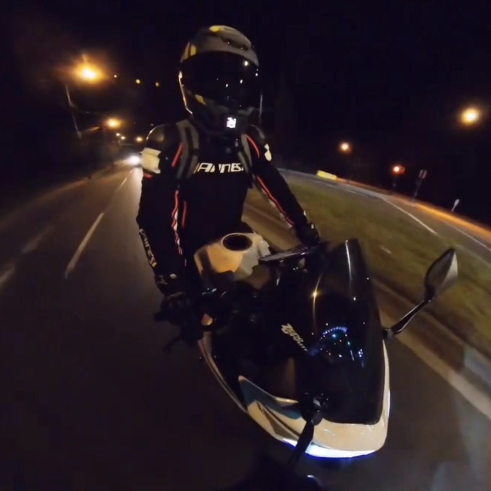

# Greetings! I’m William ~

I’m a data analyst and scientist based in Vancouver, BC, but my path here wasn’t linear. 

I started out in retail and customer service, moved into marketing and product management, and realized I was consistently drawn to the analytical challenges behind every decision. 

That curiosity pushed me to study Business and Computer Science at SFU. After graduating, I spent six years uncovering insights in the gaming industry. Eventually, I returned to school for a Master of Data Science at UBC, solidifying the career I had been gravitating toward all along.

The world of data science and AI is changing so fast that it sometimes feels challenging to keep up. Keep learning, take breaks when you have to — that's what I tell myself.

---

## Analytics & methods

- Statistical inference, predictive modeling, clustering, A/B testing
- Cohort, funnel, retention, LTV, and behavioral analytics
- Telemetry design, ELT pipelines, data modeling, automation
- Monetization, live‑ops, and product performance analytics
- Dashboarding, data storytelling, cross‑functional communication

## Tech Stack

**Languages :**  

**Visualization :**  

**Data & ML :**  

**Infrastructure & tools :**  

**Cloud Platforms :**  

**Too serious & too boring? Let's slack a bit and have agents to do the work~**

## Some of my other licenses and hobbies

#### PADI Advanced Open Water Recreational Diver License

#### Motorcycle License

#### Archery

#### Sight-seeing
